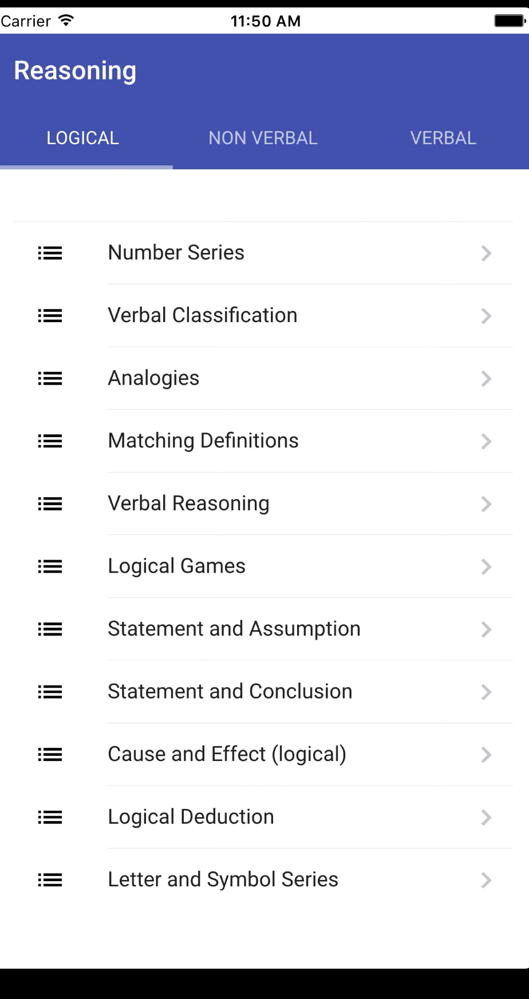
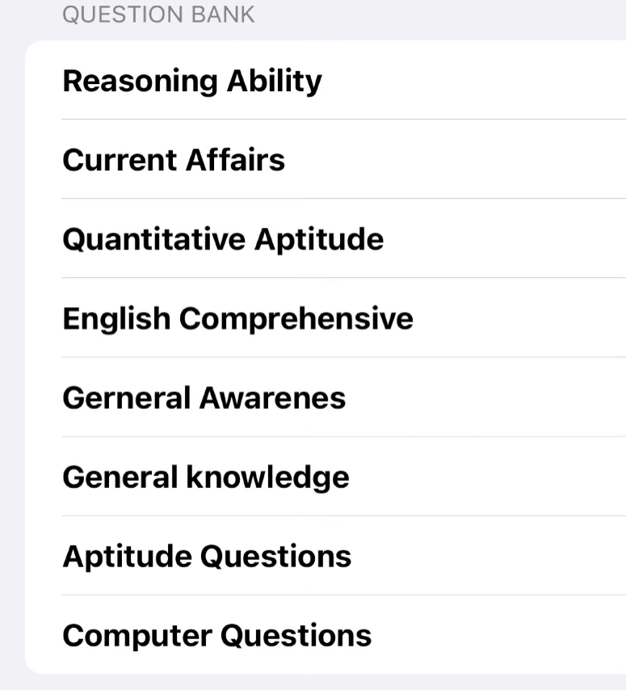
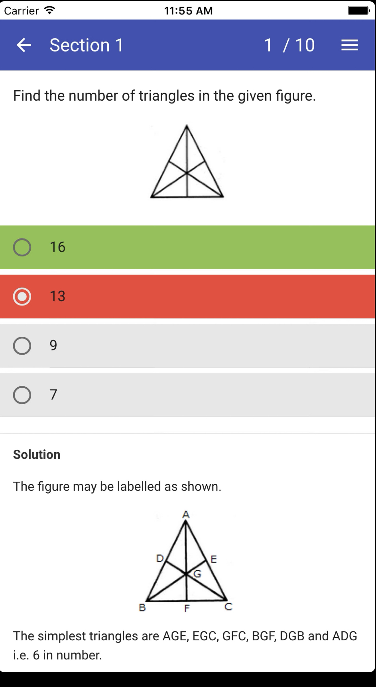

# Django_quiz_creation

Don't bother about UIs, we're here for APIs,
Here you need to identify the schema/model fields by observing the UIs, The goal of this assignment is to build **_API_** for a **Quiz  Creation** site in which you are free to play with as much as possible your sample data.

---
## NOTE:- Above images are only for reference ##

### API Features: ###

1. User (mandatory)
- Login
- Attempt Quiz
- Quiz flow should be ->select exam -> select section-> select topics-> list of quizes
- Quiz result

2. Admin (mandatory)
- Login
- Create Quiz
-  Quiz will create topic wise according to exam and sections
- add an image field in questions table
4. Authentication

- Login (mandatory)
- Logout(optional)
- Signup (optional)

5.Create Logs (optional)
 -whenever any user login , a log should be generate in login_logs table(model) (fields=user,user_type,login_at ) 
 <b>Note</b>: Use signals to create logs

## Table data examples ##
- exam table ( ssc cgl,Bank PO,UPSC etc)
- sections table  (GK,Quantative aptitude,Reasoning,English)

### Coding Guidelines ###

- Please fork current problem repository or use it as template and, add  [@nitesh5695smilebots](https://github.com/nitesh5695smilebots) as collaborator while intializing repository in github. And follow the given timeline instructions from your mail.
- The changes/commits will not be considered after timeline mentioned in your mail.
- Please avoid any frameworks and libraries except **_Django REST framework_**.
- Focus more on the **_Django REST framework_** side of the problem.
- You need to add requirements.txt file in project
- Add a readme.md file and add all details about your APIs.
- You will be evaluated on a **WORKING PROJECT** for:
  - Modularity of Code
  - Security
  - Data Structures used
  - Model serialization
  - Database designing
  - Logic and cleanliness of code.
  - Completeness.
- Please ask us for any hurdle in your problem assignment.

<b>Note: <b> please use sqlite database and tables should be related to other tables.
